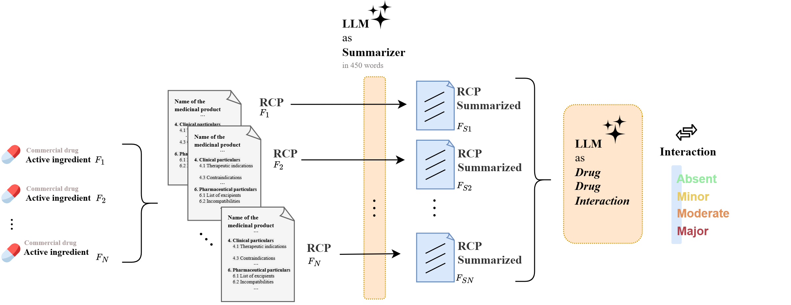

# 💊 *D*rug *A*nnotation for *R*etrieval and *T*ext-mining (DART)

<div align="center">
    <a href="https://huggingface.co/datasets/praiselab-picuslab/DART" target="_blank"></a>
    <a href="LICENSE" target="_blank"></a>
</div>
<hr>

**DART** (Drug Annotation for Retrieval and Text-mining) is a structured dataset of Italian drug product leaflets (*"Riassunti delle Caratteristiche del Prodotto"*, or RCPs), curated for Clinical NLP applications. It provides processed regulatory texts segmented into standard sections and enriched with metadata and pharmacological information, ideal for developing and evaluating models in tasks such as:

- Adverse Drug Reaction (ADR) extraction  
- Drug-Drug Interaction (DDI) classification  
- Clinical document retrieval  
- Regulatory question answering  

---

### 🔓 How to Access the Dataset

You can access the **DART** dataset via [Hugging Face](https://huggingface.co/datasets/praiselab-picuslab/DART). Follow these steps to download it:

```python
from datasets import load_dataset

# Login using e.g. `huggingface-cli login` to access this dataset
dataset = load_dataset("praiselab-picuslab/DART")
````

---

### 🌟 Key Features

* 🗣️ **Language**: Italian 🇮🇹
* 📄 **Source**: Official RCPs from the AIFA (Italian Medicines Agency)
* 🧩 **Structure**: Each document is segmented into EMA-compliant sections (e.g., 4.1, 4.3, 4.5, 6.1)
* 📊 **Metadata**: Includes pharmaceutical reimbursement class, therapeutic class, AIC code
* 🔬 **Applications**: Structured document understanding, ADR/DDI extraction, QA, semantic search

---

### 🔄 Dataset Construction

The **DART** dataset was built using a three-step pipeline, designed for reproducibility and scalability:

1. **URL Retrieval**
   Automated crawling of RCP URLs from the official AIFA portal.

2. **Semantic Parsing**
   Extraction and segmentation of regulatory text based on EMA sectioning schema.

3. **Structuring & Validation**
   Normalization of textual content and enrichment with drug-level metadata. The entire process was implemented in Python using open-source libraries.

<p align="center">
  
</p>

---

### 📊 Dataset Statistics

#### General Overview

| **Statistic**                 | **Value**  |
| ----------------------------- | ---------- |
| Number of Medicines           | 16,029     |
| Number of Therapeutic Classes | 6          |
| Last Update                   | May 2025   |
| Total Tokens                  | 95,760,718 |
| Unique Vocabulary             | 102,749    |
| Avg. Tokens per Document      | 177.47     |

#### Distribution by Reimbursement Class (AIFA Classification)

| **Class Code** | **Frequency** |
| -------------- | ------------- |
| A              | 5,156         |
| C              | 5,406         |
| C-bis          | 942           |
| C-nn           | 1,724         |
| H              | 1,599         |
| N              | 1,842         |

---

### 🚀 Application Example: LLM-based DDI Checker

We developed an **LLM-based Drug-Drug Interaction Checker** to demonstrate how DART can enhance pharmacological reasoning in generative models. By leveraging the structured knowledge encoded in DART, the system improves over popular online baselines such as **Drugs.com**, **Medscape**, **WebMD**, and **RxList**, especially in the detection and severity classification of DDIs.

The tool operates in a zero-shot or retrieval-augmented manner and has shown improved precision in Italian-language medical contexts.

<p align="center">
  
</p>

---

### 🧠 Other Applications

* Fine-tune LLMs for Italian-language clinical NLP
* Train information extraction models for ADRs and DDIs
* Build semantic search engines for pharmacological content
* Develop QA/RAG systems over regulatory biomedical texts

---

### 🤝 Contributing

We welcome contributions to improve the dataset! To contribute, simply open a pull request or report issues on our [issue tracker](https://github.com/PRAISELab-PicusLab/DART/issues). We look forward to your improvements!

👨‍💻 This project was developed by Giuseppe Riccio, Antonio Romano, Mariano Barone, Antonio Laudante, Marco Postiglione, and Vincenzo Moscato
*University of Naples Federico II* – [PRAISE Lab - PICUS](https://github.com/PRAISELab-PicusLab/)

---

### 📜 License

This work is licensed under a
[Creative Commons Attribution-NonCommercial 4.0 International License](https://creativecommons.org/licenses/by-nc/4.0/).

[](https://creativecommons.org/licenses/by-nc/4.0/)
